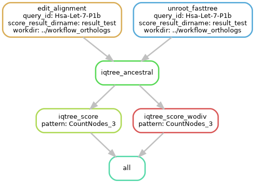
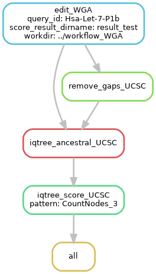

# PHylogeny-Aware Computation of Tolerance for Nucleotide Substitutions (PHACTn)

This folder contains PHACTn, a modular Snakemake-based pipeline for phylogeny-aware prediction of the functional impact of nucleotide substitutions.

PHACTn extends the principles of the original PHACT framework—previously designed for amino acids—to the nucleotide level, capturing evolutionary signals through ancestral reconstruction, substitution weighting, and distance-aware scoring.

The pipeline integrates phylogenetic tree structure, ancestral state probabilities, and nucleotide context to assess the potential deleteriousness of mutations. It is built for large-scale analysis of multiple sequence alignments and supports genomic alignments such as UCSC WGA.


__________________________

### ⚙️ Dependencies

#####  Create  and activate the conda environment

```
conda env create -f conda_env.yml
conda activate PHACTn
```
This will install all necessary dependencies including:

R (with packages: `ape`, `bio3d`, `dplyr`, `stringr`, `tidytree`)

Python libraries (`biopython`, `ete3`, `snakemake`, etc.)

IQ-TREE and RAxML-NG

### 🚀 Running the Pipeline

There are two pipelines in the directory `workflow_orthologs` for alignments created from orthologs and `workflow_WGA` for whole genome alignments.

##### Workflow for orthologs:



##### Workflow for WGA from UCSC 470 Mammals:



**1) Configure your workflow:** 

Edit `config/config_orthologs.yaml` and `config/config_WGA.yaml` to set paths, filenames, and parameters.

###### Field descriptions:

`workdir`: Working directory for Snakemake to operate in. All results (e.g., ancestral trees, scores) will be saved under this directory.

`query_ids_file`: A text file containing one query ID per line. Each ID typically corresponds to a unique orthologous group or miRNA. These IDs are used to identify the alignments and trees for downstream processing.

`score_result_dirname`: Subdirectory inside workdir where the final score results will be saved.

`iqtree_ancestral_model`: Path to the substitution model specification used by IQ-TREE for ancestral reconstruction.

`iqtree_seed`: Seed value for random number generation to ensure reproducibility of IQ-TREE results.

`weights`: Comma-separated list of weight schemes or scoring strategies to apply during score calculation.

`pattern`: The scoring mode(s) to compute, selected from the weights list. Controls which scoring outputs are written or focused on in summary files.

###### specific to config_orthologs.yaml

`alignment_pattern`: Path template for accessing multiple sequence alignment files. `{query_id}` will be dynamically replaced with each ID from query_ids_file.

`MLtree_files_pattern`: Path template to the maximum likelihood tree for each alignment.

###### specific to config_WGA.yaml

`msa_file_pattern`: Path template for accessing Whole Genome Alignment files. `{query_id}` will be dynamically replaced with each ID from query_ids_file.

`tree_file_path` : Path to the unrooted phylogenetic tree used for ancestral reconstruction and scoring.

**2) Test workflow**
```
cd workflow_orthologs
snakemake --dry-run --config query_ids_file="test.txt"
```
It essentially lists the total number of jobs (rules) completed as well as the sets of input and output files that were produced and utilized, respectively. In this example, 6 tasks will be run for the one query file that are provided. These jobs are described below.

For orthologs:

```
Job stats:
job                   count
------------------  -------
all                       1
edit_alignment            1
iqtree_ancestral          1
iqtree_score              1
iqtree_score_wodiv        1
unroot_fasttree           1
total                     6

```
For WGA:

```
Job stats:
job                      count
---------------------  -------
all                          1
edit_WGA                     1
iqtree_ancestral_UCSC        1
iqtree_score_UCSC            1
remove_gaps_UCSC             1
total                        5
```

**3) Run workflow**

After modifying the configfile and preparing the environment, workflow can be run with:
```
snakemake --keep-going --rerun-incomplete --jobs 64
```

**Output directories**

The outputs will be in a subfolder of results with their query_id prefix. Each query id folder has its own processed multiple sequence alignment, unrooted maximum likelihood phylogenetic tree, ancestral sequence reconstruction and their computing score. The result/query_id directory will have the following structure:

##### for orthologs:
```
.
├── 1_processed_msa
├── 2_unrooted_tree
├── 3_iqtree_ancestral
├── 4_iqtree_ancestral_scores
├── 5_iqtree_ancestral_scores_woDiv
5 directories
```
##### for WGA:

```
.
├── 1_preProcessing
├── 2_iqtree_ancestral
├── 3_iqtree_ancestral_scores
3 directories
```

## 🐍 Snakemake Workflow Overview

### workflow_orthologs:

The main pipeline is defined in the `workflow_orthologs/Snakefile`, which includes modular rules split across `.smk` files:

```
configfile: "../config/config_orthologs.yaml"
workdir: config["workdir"]
config["result_dir"] = f"{config['workdir']}/{config['score_result_dirname']}"

include: "rules/edit_aln.smk"
include: "rules/unroot_tree.smk"
include: "rules/ancestral_reconstruction.smk"
include: "rules/score_calculation.smk"
include: "rules/score_calculation_woDiv.smk"
include: "rules/UCSC_score_calculation.smk"
```

### 🔧 Modular Rule Scripts

#### 🟢`rules/edit_aln.smk`

Prepares alignments:

* Converts .aln to FASTA

* Replaces uracils (U) with thymines (T)

* Removes alignment columns containing gaps in the human sequence

**input:** Initial msa file with `.aln` format.

**output:** `{query_id}/1_processed_msa/{query_id}_converted_nogap.fasta`

🛠 Script Used: `scripts/edit_aln.py`

#### 🔵`rules/unroot_tree.smk`

Unroots the tree using the ape R package.

**input:** Initial maximum likelihood tree.

**output:** `{query_id}/2_unrooted_tree/{query_id}_precursor_annotated.treefile_unrooted`

🛠 Script Used: `scripts/unroot_tree.R`

#### 🔴`rules/ancestral_reconstruction.smk`

Runs ancestral state reconstruction with IQ-Tree using the pre-defined custom model, `scripts/notr_model.txt`.

**input:**
`{query_id}/1_processed_msa/{query_id}_converted_nogap.fasta`

 `{query_id}/2_unrooted_tree/{query_id}_precursor_annotated.treefile_unrooted`

**output:** ancestral probabilities: `{query_id}/3_iqtree_ancestral/{query_id}.state`

ancestral tree: `{query_id}/3_iqtree_ancestral/{query_id}.treefile`

#### 🟣`rules/score_calculation.smk`

Computes site-wise scores with diversity weighting using probabilistic ancestral reconstructions.

**input:**
`{query_id}/1_processed_msa/{query_id}_converted_nogap.fasta`

`{query_id}/3_iqtree_ancestral/{query_id}.state`

`{query_id}/3_iqtree_ancestral/{query_id}.treefile`

**output:** 

`{query_id}/4_iqtree_ancestral_scores/{query_id}_wl_param_{pattern}.csv`

`{query_id}/4_iqtree_ancestral_scores/{query_id}_wol_param_{pattern}.csv`

🛠 Script Used: `scripts/computescores.R`

#### 🟡`rules/score_calculation_woDiv.smk`

Computes scores without diversity correction.

**input:**
`{query_id}/1_processed_msa/{query_id}_converted_nogap.fasta`

`{query_id}/3_iqtree_ancestral/{query_id}.state`

`{query_id}/3_iqtree_ancestral/{query_id}.treefile`

**output:** 

`{query_id}/5_iqtree_ancestral_scores_woDiv/{query_id}_wl_param_{pattern}.csv`

`{query_id}/5_iqtree_ancestral_scores_woDiv/{query_id}_wol_param_{pattern}.csv`


🛠 Script Used: `scripts/computescores_woDiv.R`
_____________________

### workflow_WGA:

### 🔧 Rules

#### 🟠`edit_WGA`

Filters and prepares a UCSC multi-species alignment (MSA) for ancestral state reconstruction:

* Removes sequences that consist entirely of gaps

* Optionally reverse-complements sequences if the query miRNA is on the minus strand

* Prunes the input phylogenetic tree to retain only sequences present in the filtered MSA

**input:** 

Initial sub whole genome alignment that corresponds to miRNA positions.

Phylogenetic tree that belongs to the whole genome alignment.

**output:** 

`{query_id}/1_preProcessing/{query_id}_filtered.fasta`

`{query_id}/1_preProcessing/{query_id}_pruned.nwk`

🛠 Script Used: `scripts/edit_aln_UCSC.py`

#### 🟤`remove_gaps_UCSC`

Removes alignment columns that contain gaps in the human sequence.

**input:**

`{query_id}/1_preProcessing/{query_id}_filtered.fasta`

**output:**

`{query_id}/1_preProcessing/{query_id}_filtered_nogap.fasta`

🛠 Script Used: `scripts/rm_gaps.py`


#### ⚫`iqtree_ancestral_UCSC`

Performs ancestral state reconstruction with IQ-TREE on the preprocessed MSA and tree. Uses custom substitution model from scripts/notr_model.txt Outputs ancestral probabilities and the reconstructed ancestral tree

**input:**

`{query_id}/1_preProcessing/{query_id}_filtered_nogap.fasta`

`{query_id}/1_preProcessing/{query_id}_pruned.nwk`

**output:**

Ancestral probabilities: `{query_id}/2_iqtree_ancestral/{query_id}.state`

Reconstructed tree: `{query_id}/2_iqtree_ancestral/{query_id}.treefile`


#### ⚪`iqtree_score_UCSC`

Computes site-wise scores with diversity weighting using probabilistic ancestral reconstructions.

**input:**

`{query_id}/2_iqtree_ancestral/{query_id}.treefile`

`{query_id}/2_iqtree_ancestral/{query_id}.state`

`{query_id}/1_preProcessing/{query_id}_filtered_nogap.fasta`

**output:**

`{query_id}/3_iqtree_ancestral_scores/{query_id}_wl_param_{pattern}.csv`

`{query_id}/3_iqtree_ancestral_scores/{query_id}_wol_param_{pattern}.csv`

🛠 Script Used: `scripts/computescores.R`

____________

### Score Files Description

The `scripts/computescores.R` script generates two types of score files for each parameter setting, distinguished by their suffixes:

_wl_param_[X].csv: Scores with leaf contributions (weighted by evolutionary distance and topology, namely, full evolutionary context).

_wol_param_[X].csv: Scores without leaf contributions (Focus on ancestral nodes only).

The [X] in filenames reflects the parameter weighting scheme (e.g., max05, mean, CountNodes_3)

#### Parameter Options

The parameters in PHACTn control how the pipeline weighs phylogenetic information when calculating the functional impact of nucleotide substitutions.

Passed via args[6] (comma-separated for multiple runs, e.g., "0,mean,CountNodes_3").

**Inverse-Distance Weights:**

`0` (Default)

Logic: Weights = 1 / (normalized_distance + 1)

Normalizes distances by the minimum leaf distance (excluding human).


`0_MinNode`

Similar to 0, but normalizes by the minimum node distance (not leaves).

`0_MinNode_Mix` / `0_MinNode_Mix2`

Hybrid of inverse-distance and Gaussian weights:

Combines 1/distance and exp(-distance²/mean²).

Mix2 applies weaker Gaussian damping.

**Gaussian Weights**

`mean`

Weights = exp(-distance² / mean_distance²)

Bandwidth = mean of all distances.

`median`

Like mean, but uses median distance as bandwidth.

`X`

Adjusts for minimum distance offset:

Weights = exp(-(distance - min_distance)²) / 2

Human leaf weight fixed to 1.

`Custom Value (e.g., 0.5)`

User-defined bandwidth:

Weights = exp(-distance² / custom_parameter²)

**Topology-Aware Weights**

Incorporates the number of nodes between a branch and the human reference:

`CountNodes_1`

Weights = (exp(-distance²) + 1/nodes_conn) / 2

Balances distance and node count (simpler).

`CountNodes_2`

Weights = (exp(-distance²) + exp(-nodes_conn²)) / 2

Smooths node-count influence.

`CountNodes_3`

Weights = sqrt(exp(-distance²) * (1/nodes_conn))

Geometric mean of distance and node count.

`CountNodes_4`

Weights = exp(-(sqrt(distance * nodes_conn))²)

Penalizes long paths with many nodes.

**Special Cases**

`Equal`

Uniform weights (1.0 for all branches).

`MinThreshold`

Linear weights ensuring a user-defined minimum (param_min):

Weights = (-1 + param_min)/max_distance * distance + 1

`MinThreshold_Gauss`

Gaussian version of MinThreshold.

#### Output File Structure

Both files are CSV tables with the same format:

| Pos/NT | A         | T         | G         | C         |
|--------|-----------|-----------|-----------|-----------|
| 1      | `score_A` | `score_T` | `score_G` | `score_C` |
| 2      | `...`     | `...`     | `...`     | `...`     |

`Pos/NT:` Genomic position (1-based).

`Columns A/T/G/C:` Scores for each possible nucleotide state at that position.

#### Score Interpretation

* Scores are normalized between 0 and 1.

* Lower values indicate stronger predicted functional impact (more "deleterious").


### References

Kuru, N., Dereli, O., Akkoyun, E., Bircan, A., Tastan, O., & Adebali, O. (2022). PHACT: Phylogeny-aware computing of tolerance for missense mutations. Molecular Biology and Evolution. https://doi.org/10.1093/molbev/msac114