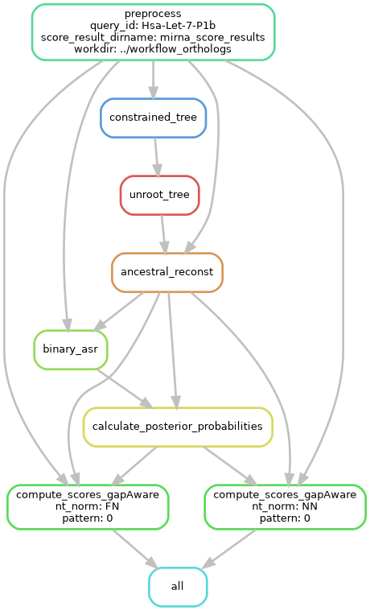
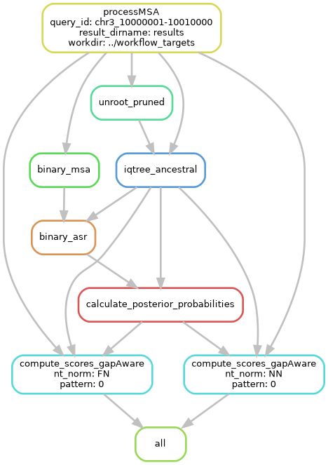

# PHylogeny-Aware Computation of Tolerance for Nucleotide Substitutions (PHACTn)

This folder contains PHACTn, a modular Snakemake-based pipeline implementing PHACTn (Phylogeny-Aware Computing of Tolerance for nucleotide variants), a training-free, parameter-minimal method for inferring the tolerability of single-nucleotide variants across the genome (Yildirim, et al., 2026).

PHACTn extends the principles of the original PHACT framework (Kuru et al., 2022), previously designed for missense/amino-acid substitutions, to the nucleotide level. It traverses a phylogenetic tree and explicitly models the evolutionary independence of observed nucleotide substitutions and their distance from the query species, so that a single ancestral mutation shared by many descendants is not overcounted relative to several independent substitutions at the same position. Ancestral state probabilities are combined with a gap-aware correction — reconstructed separately from a binary (gap/character) encoding of the alignment — so that positions where an indel is the more likely ancestral event are not forced into misleading nucleotide probabilities.

The pipeline integrates phylogenetic tree structure, gap-aware ancestral state probabilities, and distance-based phylogenetic weighting to produce a continuous [0, 1] tolerability score per nucleotide at each alignment position (lower = less tolerated / more likely deleterious). 

There are **two** Snakemake workflows in this directory:

* **`workflow_orthologs`** — scores a miRNA multiple sequence alignment built from that miRNA's orthologs across 114 species, using a consensus species tree as the phylogenetic backbone (see `construct_consensus/` for how the underlying species tree is derived).
* **`workflow_targets`** — genome-wide scoring of genomic target positions, as described in the PHACTn manuscript (Yildirim et al., 2026). Scores a UCSC whole-genome-alignment block (e.g. a genomic window around a miRNA target site) against a single fixed reference tree (470 mammals).

__________________________

### Dependencies

##### Create and activate the conda environment

```
conda env create -f workflow_orthologs/conda_env.yml
conda activate PHACTn
```

This installs the shared core dependencies:

R (with packages: `ape`, `bio3d`, `dplyr`, `stringr`, `tidytree`)

Python libraries (`biopython`, `ete3`, `snakemake`, `pandas`, etc.)

IQ-TREE and RAxML-NG

`workflow_targets` additionally uses per-rule conda environments (`workflow_targets/envs/core.yml`, `envs/asr.yml`, `envs/score_r.yml`), activated automatically via `snakemake --use-conda`.

__________________________

## Workflow 1: `workflow_orthologs`



Scores a multiple sequence alignment of one-to-one orthologs against a species tree, using RAxML-NG for ancestral reconstruction and the same gap-aware correction described above. The reference topology is a fixed consensus tree (`consensus_timetree.nwk`, built from TimeTree/MirGeneDB species lists — see `construct_consensus/`), which RAxML-NG re-optimizes as a constraint tree per alignment.

**1) Configure your workflow:**

Edit `config/config_orthologs.yaml` to set paths, filenames, and parameters.

###### Field descriptions

`workdir`: Working directory for Snakemake to operate in. All results (e.g., ancestral trees, scores) will be saved under this directory.

`query_ids_file`: A text file containing one query ID per line (e.g. `test/input_mirna.txt`). Each ID typically corresponds to a unique miRNA.

`score_result_dirname`: Subdirectory inside `workdir` where the final score results will be saved.

`id_prefix`: Suffix appended to each query ID to form the sequence ID of the query species inside its alignment (e.g. `_pri` for primary miRNA transcripts).

`consensus_tree`: Path to the fixed consensus species tree used as a topological constraint for every query (e.g. `consensus_timetree.nwk`).

`alignment_pattern`: Path template for the per-query alignment files (Clustal `.aln` format); `{query_id}` is substituted per query.

`nt_norms`: List of score normalization modes to run, one output set per entry. (`NN`:  divides by the number of tree nodes `(num_nodes + num_leaves)` for `_wl_` scores, `num_nodes` for `_wol_` socres; `FN`: divides by the number of species that carry the same nucleotide as the query species at that alignment position.)

`raxml_model`: RAxML-NG substitution model used for both tree search and ancestral reconstruction (e.g. `GTR{../scripts/notr_model.txt}+R4`).

`raxml_seed`: Seed for RAxML-NG reproducibility.

`weights`: Comma-separated list of weight schemes to compute during score calculation.

`pattern`: The weight scheme(s), selected from `weights`, for which output files are actually written.

**2) Test workflow**

```
cd workflow_orthologs
snakemake --dry-run
```

For one query ID this runs the following jobs:

```
Job stats:
job                                  count
---------------------------------  -------
all                                      1
ancestral_reconst                        1
binary_asr                               1
calculate_posterior_probabilities        1
compute_scores_gapAware                  2
constrained_tree                         1
preprocess                               1
unroot_tree                              1
total                                    9
```

**3) Run workflow**

```
conda activate PHACTn
snakemake --keep-going --rerun-incomplete --jobs 64 
```

**Output directories**

Results are written under `{workdir}/{score_result_dirname}/{query_id}/`:

```
.
├── 1_preProcessing
├── 2_raxmlng_ancestral
├── 3_binary_raxmlng_ancestral
├── PHACTn_gapAware_scores_{nt_norm}
4 directories
```

### Rules (`workflow_orthologs/rules/`)

#### `1_preprocessing.smk`

**Rule `preprocess`**

Script: `preprocess.py`

Converts the Clustal alignment to FASTA (U→T), drops alignment columns that are gapped in the query sequence, and additionally emits a binary (gap/no-gap) encoding of the same alignment.

**input:** per-query alignment (`alignment_pattern`), `consensus_tree`.

**output:** `{query_id}/1_preProcessing/{query_id}_filtered_nogap.fasta`, `{query_id}/1_preProcessing/{query_id}_filtered_nogap.fasta_Binary`

**Rule `constrained_tree`**

Tool: RAxML-NG (`raxml-ng --search --tree-constraint`)

The consensus tree (`consensus_timetree.nwk`) only defines which species group together; its branch lengths are not fitted to this alignment. This rule runs an ML tree search in RAxML-NG with the consensus tree as a topological constraint (`--tree-constraint`), so the resulting tree is compatible with the consensus clades while its branch lengths, and any unresolved branching, are estimated from this specific alignment. 

**input:** `{query_id}/1_preProcessing/{query_id}_filtered_nogap.fasta`, `consensus_tree`.

**output:** `{query_id}/1_preProcessing/{query_id}.raxml.bestTree`

**Rule `unroot_tree`**

Script: `../scripts/unroot_tree.R`

Unroots the branch-length-optimized tree `.raxml.bestTree` with the `ape` R package.

**input:** `{query_id}/1_preProcessing/{query_id}.raxml.bestTree`

**output:** `{query_id}/1_preProcessing/{query_id}.bestTree_unrooted`

#### `2_asr.smk`

**Rule `ancestral_reconst`**

Tool: RAxML-NG (`raxml-ng --ancestral`)

Runs nucleotide ancestral state reconstruction to infer the inner node probabilities on the filtered alignment and unrooted, branch-length-optimized tree from step 1.

**input:** `{query_id}/1_preProcessing/{query_id}_filtered_nogap.fasta`, `{query_id}/1_preProcessing/{query_id}.bestTree_unrooted`

**output:** `{query_id}/2_raxmlng_ancestral/{query_id}.raxml.ancestralProbs`, `{query_id}/2_raxmlng_ancestral/{query_id}.raxml.ancestralTree`

#### `3_asr_binary.smk`

**Rule `binary_asr`**

Tool: RAxML-NG (`raxml-ng --ancestral --model BIN`)

Runs ancestral reconstruction on the binary (gap/no-gap) alignment from `preprocess`, using the topology of the nucleotide ancestral tree. `--model BIN` automatically determines the best-fit model for each alignment using an information criterion, therefore the selected model can differ between alignments. This is intentional because gaps for missing species are inserted manually, so the true gap/no-gap ratio varies per ortholog set and a fixed 50/50 assumption, as used in the workflow_targets, would fit the data poorly. 

**input:** `{query_id}/1_preProcessing/{query_id}_filtered_nogap.fasta_Binary`, `{query_id}/2_raxmlng_ancestral/{query_id}.raxml.ancestralTree`

**output:** `{query_id}/3_binary_raxmlng_ancestral/{query_id}.raxml.ancestralProbs`, `{query_id}/3_binary_raxmlng_ancestral/{query_id}.raxml.ancestralTree`

#### `4_gapAware_probas.smk`

**Rule `calculate_posterior_probabilities`**

Script: `../scripts/postProba_indelPerc.py`

Combines the nucleotide ancestral probabilities (step `2_asr.smk`) with the gap ancestral probabilities (step `3_asr_binary.smk`) into gap-aware posterior nucleotide probabilities per node/site (prior × P(no gap)).

**input:** `{query_id}/3_binary_raxmlng_ancestral/{query_id}.raxml.ancestralProbs`, `{query_id}/2_raxmlng_ancestral/{query_id}.raxml.ancestralProbs`

**output:** `{query_id}/2_raxmlng_ancestral/{query_id}_gapAware_probabilities.tsv`

#### `5_gapAware_scores.smk`

**Rule `compute_scores_gapAware`**

Script: `../scripts/PHACTn_scripts/computescores_{nt_norm}.R` (e.g. `computescores_NN.R`, `computescores_FN.R`)

Computes final site-wise nucleotide scores from the gap-aware posterior probabilities, once per `nt_norm` entry, using `Hsa (human)` as the fixed reference/query species code.

**input:** `{query_id}/2_raxmlng_ancestral/{query_id}_gapAware_probabilities.tsv`, `{query_id}/2_raxmlng_ancestral/{query_id}.raxml.ancestralTree`, `{query_id}/1_preProcessing/{query_id}_filtered_nogap.fasta`

**output:** `{query_id}/PHACTn_gapAware_scores_{nt_norm}/{query_id}_wl_param_{pattern}.csv`, `{query_id}/PHACTn_gapAware_scores_{nt_norm}/{query_id}_wol_param_{pattern}.csv`

__________________________

## Workflow 2: `workflow_targets`



Scores UCSC whole-genome-alignment blocks (e.g. genomic windows around miRNA target sites) against a single reference tree.

**1) Configure your workflow:**

Edit `config/config_targets.yaml`.

###### Field descriptions

`workdir`: Working directory for Snakemake (results are written under `{workdir}/{result_dirname}`).

`query_ids_file`: Text file with one query ID per line (e.g. `test/query_ids.txt`).

`result_dirname`: Subdirectory inside `workdir` where results will be saved.

`msa_file_pattern`: Path template for the WGA block FASTA files; `{query_id}` is substituted per query.

`tree_file_path`: Path to the fixed reference phylogenetic tree used for every query (e.g. `470mammals_tree.nwk`).

`query_species`: Reference/query species ID in the alignment (e.g. `hg38`), used when computing scores.

`nt_norms`: List of score normalization modes to run, one output set per entry.(`NN` and `FN` by default; see `scripts/PHACTn_scripts/`).

`iqtree_ancestral_model` / `iqtree_seed`: Substitution model and seed for the nucleotide ASR step.

`weights`: Comma-separated weight scheme(s) applied during score calculation.

`pattern`: Weight scheme(s) selected from `weights` for which output files are actually written.

**2) Test workflow**

```
cd workflow_targets
snakemake --dry-run
```

This runs the following jobs per query ID:

```
Job stats:
job                                  count
---------------------------------  -------
all                                      1
binary_asr                               1
binary_msa                               1
calculate_posterior_probabilities        1
compute_scores_gapAware                  2
iqtree_ancestral                         1
processMSA                               1
unroot_pruned                            1
total                                    9
```

**3) Run workflow**

```
pip install snakemake
snakemake --keep-going --rerun-incomplete --jobs 64 --use-conda --conda-frontend conda
```

**Output directories**

Results are written under `{workdir}/{result_dirname}/{query_id}/`:

```
.
├── 1_preprocessed
├── 2_iqtree_ancestral
├── 3_binary_iqtree_ancestral
├── 4_gapAware_scores_{nt_norm}
4 directories
```

### Rules (`workflow_targets/rules/`)

#### `1_preprocess.smk`

**Rule `processMSA`**

Script: `process_MSA.py`

Filters the WGA block: removes sequences that are entirely gaps/Ns, and prunes the reference tree down to the taxa present in the filtered alignment.

**input:** WGA block FASTA (`msa_file_pattern`), reference tree (`tree_file_path`).

**output:** `{query_id}/1_preprocessed/block-{query_id}_noGapped.fasta`, `{query_id}/1_preprocessed/prunedtree_{query_id}.nwk`

**Rule `unroot_pruned`**

Script: `../scripts/unroot_tree.R`

Unroots the pruned tree from `processMSA` with the `ape` R package.

**input:** `{query_id}/1_preprocessed/prunedtree_{query_id}.nwk`

**output:** `{query_id}/1_preprocessed/prunedtree_{query_id}.nwk_unrooted`

#### `2_ASRstep.smk`

**Rule `iqtree_ancestral`**

Tool: IQ-TREE 2 (`-asr`)

Runs nucleotide ancestral state reconstruction on the filtered/unrooted alignment, using the custom model `scripts/notr_model.txt`.

**input:** `{query_id}/1_preprocessed/block-{query_id}_noGapped.fasta`, `{query_id}/1_preprocessed/prunedtree_{query_id}.nwk_unrooted`

**output:** `{query_id}/2_iqtree_ancestral/{query_id}.state.gz`, `{query_id}/2_iqtree_ancestral/{query_id}.treefile`

#### `3_BINARYmsa.smk`

**Rule `binary_msa`**

Script: `binary_msa.py`

Converts the filtered alignment into a binary presence/absence encoding (`1` = A/T/G/C, `0` = gap) to model indel state separately from nucleotide identity.

**input:** `{query_id}/1_preprocessed/block-{query_id}_noGapped.fasta`

**output:** `{query_id}/1_preprocessed/block-{query_id}.fasta_Binary`

#### `3_BINARYstep.smk`

**Rule `binary_asr`**

Tool: IQ-TREE 2 (`-asr -blfix -m JC2`)

Runs ancestral reconstruction on the binary (gap/no-gap) alignment from `binary_msa`, reusing the topology and branch lengths from the nucleotide ancestral tree (`-blfix`, so only ancestral states are inferred, not new branch lengths) with a 2-state Jukes-Cantor model (JC2). JC2 fixes the gap/no-gap frequencies to 0.5/0.5, and no model selection is performed. This differs from `workflow_orthologs`, where the binary step selects the best-fit model per alignment (see `3_asr_binary.smk` in that workflow).

**input:** `{query_id}/1_preprocessed/block-{query_id}.fasta_Binary`, `{query_id}/2_iqtree_ancestral/{query_id}.treefile`

**output:** `{query_id}/3_binary_iqtree_ancestral/{query_id}.state.gz`, `{query_id}/3_binary_iqtree_ancestral/{query_id}.treefile`

#### `4_GapAWAREstep.smk`

**Rule `calculate_posterior_probabilities`**

Script: `../scripts/postProba_indelPerc.py`

Combines the nucleotide ancestral probabilities (step `2_ASRstep.smk`) with the gap ancestral probabilities (step `3_BINARYstep.smk`) into gap-aware posterior nucleotide probabilities per node/site (prior × P(no gap)).

**input:** `{query_id}/3_binary_iqtree_ancestral/{query_id}.state.gz`, `{query_id}/2_iqtree_ancestral/{query_id}.state.gz`

**output:** `{query_id}/2_iqtree_ancestral/{query_id}_gapAware_probabilities.tsv`

#### `5_GapAWAREscore.smk`

**Rule `compute_scores_gapAware`**

Script: `../scripts/PHACTn_scripts/computescores_{nt_norm}.R` (e.g. `computescores_NN.R`, `computescores_FN.R`)

Computes final site-wise nucleotide scores from the gap-aware posterior probabilities, once per `nt_norm` entry in the config.

**input:** `{query_id}/2_iqtree_ancestral/{query_id}_gapAware_probabilities.tsv`, `{query_id}/2_iqtree_ancestral/{query_id}.treefile`, `{query_id}/1_preprocessed/block-{query_id}_noGapped.fasta`

**output:** `{query_id}/4_gapAware_scores_{nt_norm}/{query_id}_wl_param_{pattern}.csv`, `{query_id}/4_gapAware_scores_{nt_norm}/{query_id}_wol_param_{pattern}.csv`

__________________________

### Score Files Description

Both workflows produce two types of score files per parameter setting, distinguished by their suffixes:

`_wl_param_[X].csv`: Scores with leaf contributions (weighted by evolutionary distance and topology, i.e. full evolutionary context).

`_wol_param_[X].csv`: Scores without leaf contributions (focus on ancestral nodes only).

`[X]` in the filename reflects the parameter weighting scheme (e.g. `max05`, `mean`, `CountNodes_3`).

#### Parameter Options

The `weights`/`pattern` config fields control how the pipeline weighs phylogenetic information when calculating the functional impact of nucleotide substitutions. Passed as a comma-separated list for multiple runs.

**Inverse-Distance Weights:** `0`, `0_MinNode`, `0_MinNode_Mix`, `0_MinNode_Mix2`

**Gaussian Weights:** `mean`, `median`, `X`, custom value (e.g. `0.5`)

**Topology-Aware Weights:** `CountNodes_1`, `CountNodes_2`, `CountNodes_3`, `CountNodes_4`

**Special Cases:** `Equal`, `MinThreshold`, `MinThreshold_Gauss`

#### Output File Structure

Both files are CSV tables with the same format:

| Pos/NT | A         | T         | G         | C         |
|--------|-----------|-----------|-----------|-----------|
| 1      | `score_A` | `score_T` | `score_G` | `score_C` |
| 2      | `...`     | `...`     | `...`     | `...`     |

`Pos/NT`: Genomic position (1-based).

`Columns A/T/G/C`: Scores for each possible nucleotide state at that position.

#### Score Interpretation

* Scores are normalized between 0 and 1.
* Lower values indicate stronger predicted functional impact (more "deleterious").

__________________________

### References

Kuru, N., Dereli, O., Akkoyun, E., Bircan, A., Tastan, O., & Adebali, O. (2022). PHACT: Phylogeny-aware computing of tolerance for missense mutations. Molecular Biology and Evolution. https://doi.org/10.1093/molbev/msac114

Yildirim, C., Kuru, N., & Adebali, O. (2026). PHACTn enables training-free, context-independent inference of nucleotide variant tolerance across the genome. bioRxiv. https://doi.org/10.64898/2026.09.08.750126